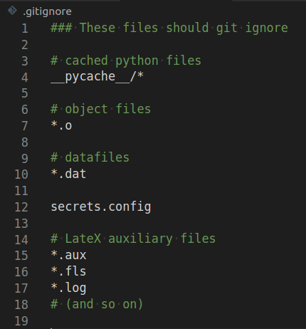
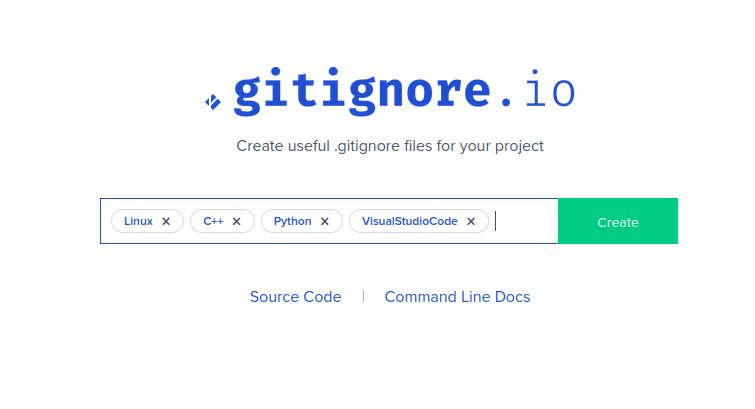

# Add a README and gitignore

## README
Make sure to add (and keep up to date) a file `README.md` at the base directory of your Git repo. GitHub will suggest adding such a file when you register a new repo. The README file should contain a short explanation of how your repository is organized, and what commands others have to run in order to build and use the various codes.

You can format the file nicely using Markdown syntax, but it is also OK to just write plain text. (**suports imgs/hyperlinks?**)

## gitignore
As with README, GitHub will also suggest adding a `.gitignore` file to your repository. A gitignore is a file that contains a list of files that git should ignore, and not track changes.

### Why ignore certain files?
Some files you do not want git to track. This can either be because they are large data-files, auxiliary files that are not useful for anything else than the program that wrote them, or configuration files containing sensitive information.

Git has a file-limit of 100MB, and GitHub will give you a warning if you push a file larger than 50MB. Tracking changes in very large files reduces performance and git can be noticably slow. When coding in python, you will often get a folder called `__pycache__` which the python interpreter is using, but not useful for you or others. Object files, compiled `C++` files that have not been linked (i.e. `main.o`) also do not need to be tracked by git. And if you're using TeXstudio, you will find many files with weird file extensions in your folder after having compiled the pdf. All these files are perfectly happy being left alone without needing to be monitored by git, or pushed to GitHub.

When typing `git status` in the terminal, you will get a list of all files in the repo that either have been changed, or git is not tracking the changes of. If there are many files that you dont want to be tracked, this can be quite cluttered, and you can miss files that you want git to track:

Therefore, a `.gitignore` is useful, as it tells git to ignore these files.

### How to make a gitignore-file
A gitignore file is simply a file called `.gitignore`, located in the root directory of your repository. Notice that there is no file-extension. The punctuation-mark at the start means that it is hidden, and will not show up when typing `ls`. To see it, type `ls -a`, or simply `la`, in the terminal.

It is a text-file where each line is a pattern that git looks for in the names of the files in your repository. It can either be specific files, or use the wild-card pattern `*` to match all files with certain extensions. For example, `*.o` matches all object files with extension `o`. And example of a gitignore for the repo in the image above could look like this:

It can be a hassle to write a gitignore file yourself, so there are tools to help you online. As mentioned above, GitHub lets you make one from a template when making a new repository. If you want more controll over what is placed in the gitignore-file, gitignore-generators lets you specify which tools you are using, and gives you a `.gitignore` for these. For instance, if you use Linux, code in `C++` and Python, using the editor VSCode, it could look like this:

Hitting 'Create' will take you to a website you can copy and paste into your `.gitignore`. You can then add more lines for your specific needs. The link to the gitignore-generator used above is [here](https://www.toptal.com/developers/gitignore/).
