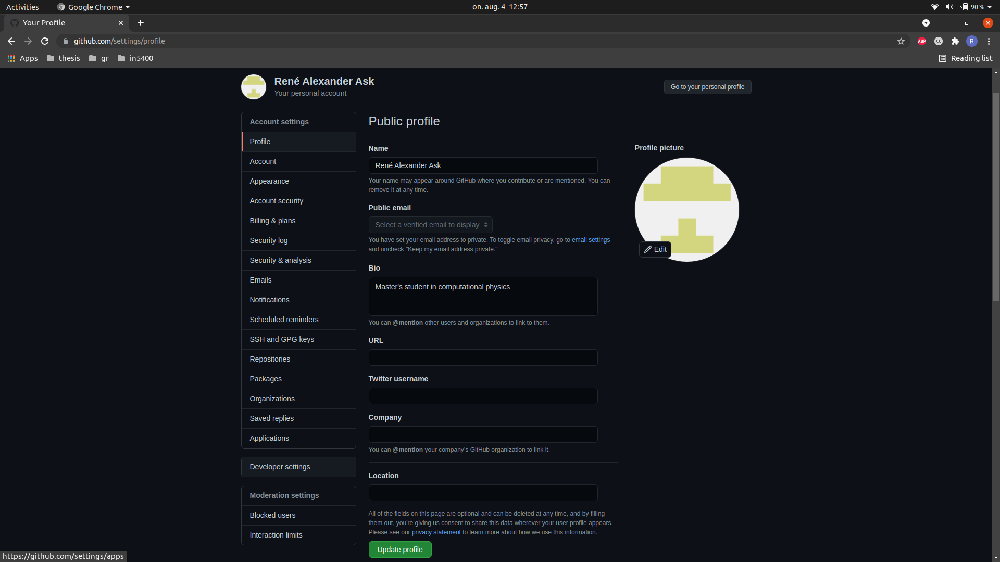
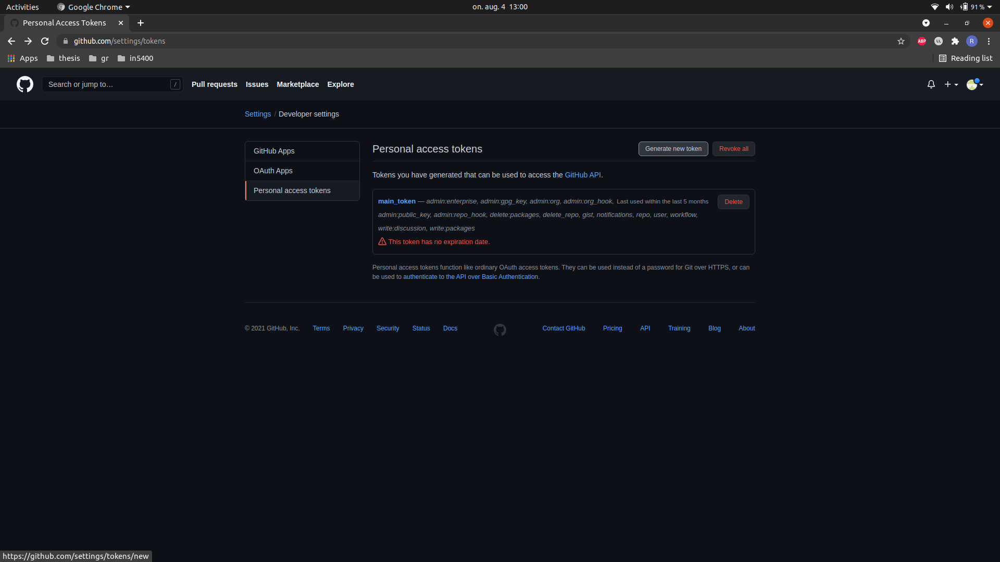
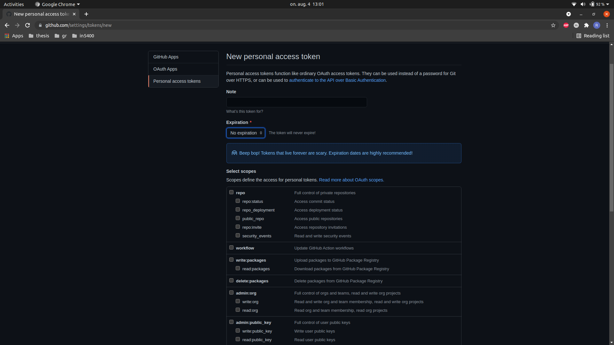

# Setting up Git and a GitHub repository

## Setting up Git on your computer

You need to tell Git which user you are. Write the following commands in your terminal:

```sh
git config --global user.name your_user_name_spelled_out

git config --global user.email you@yourdomain.com
```

## Create a GitHub repository

Here's a step-by-step instruction to create a repository ("repo"):

- Go to [github.com](https://github.com/) and log in. The page should look something like this:


- Click on the green button named *Create repository*. You should be redirected to a page that looks like this:


- Fill out your desired repository name, for instance *fys3150*
  - Keep the repository *public*.
  - Toggle *add a README file*.
  - Click *create repository*.
  - You'll be automatically redirected to the home page of your repository, see the image below.


- Clone your repository to your computer.  
  - Click on the green button named *code*.
  - Copy the link.
  - Run in your terminal:
    ```sh
    git clone the_repository_link_you_copied
    ```

Now you've cloned the repository to your computer! This will be a directory you can now find locally on your computer.


## Adding a GitHub token


A GitHub token is a replacement of passwords to give you as a user access to perform action on your GitHub repositories from your computer.

Disclaimer: Note that this is not a secure option, as the token will be saved in clear text. But it's nevertheless the simplest option.


- Go to [github.com](https://github.com/). Click on your profile in the upper right corner, then on *settings*.


- Click on *developer settings*.



- Click on *Personal access tokens* and then click on *Generate new token*.



- Your page should look somethings like what follows.
    - Fill out note with a name for the token, for instance *main_token*.
    - Change expiration date to *no expiration* (you can choose a finite expiration if security bothers you. But this is a school project, not a multibillion dollar code project.)
    - Toggle every box under *select scopes*. Most of them are unnecessary, but we just want full access.
    - Click *Generate token* at the bottom of the screen.



- You'll be redirected to the page with your token now. *Make sure you copy it!*


### On Linux

- In your GitHub repository (locally on your computer) do the following:

1. Create a non-empty .txt file by running:

```
echo "This is a line" > tmp.txt
```

2. Call credential.helper again:

```sh
git config --global credential.helper store
```

3. Add, commit and push the changes:

```sh
git add --all && git commit -m "added a dummy file to add token" && git push
```
Once you run the last command, Git will require authentication. Type in your GitHub username and paste in your token as a replacement for a password.


- Type in your username (you'll be prompted to do so.)

- Paste in the token you copied instead of your password.

Finally, you can remove the file `tmp.txt`. It has served its purpose.

And you're done!

### On macOS

1. Open the **Keychain Access** app.
2. Search for github.com and double click on the one marked with "internet password".
3. Click on "show password" and replace the password with your generated token.
